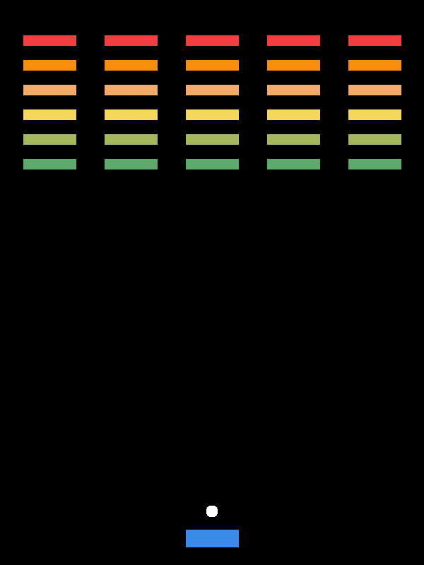

# SDL Breakout

SDL Breakout is a clone of Breakout, a game originally released in 1976 by
Atari.



## Dependencies

SDL Breakout depends on [SDL](https://github.com/libsdl-org/SDL) and [SDL
TTF](https://github.com/libsdl-org/SDL_ttf). SDL Breakout also uses
[Inconsolata Bold](https://levien.com/type/myfonts/inconsolata.html) for any
text.

## Play

```sh
$ make
$ ./build/breakout
```
